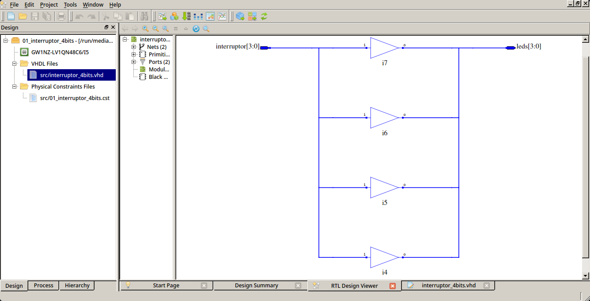
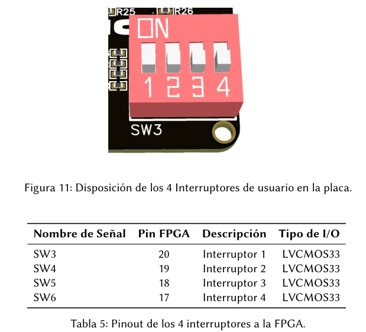
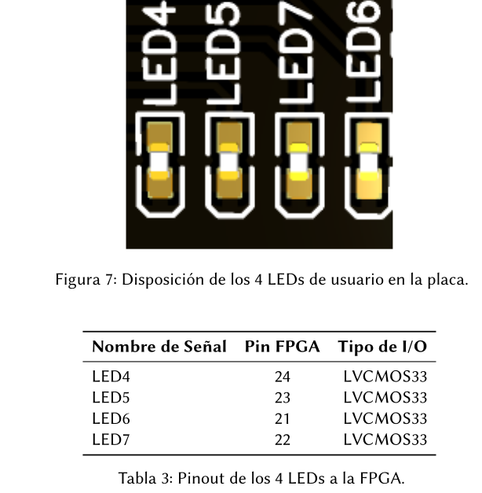
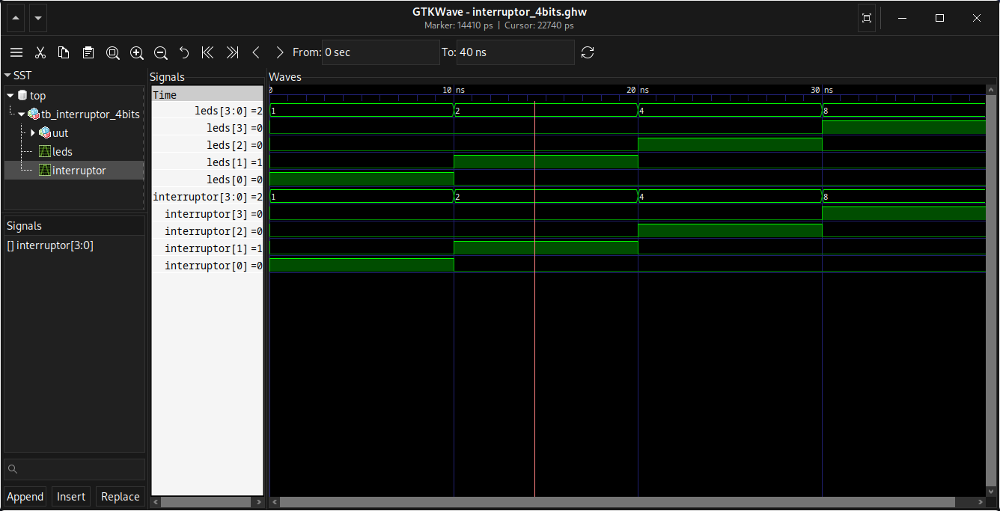

# 01_interruptor_4bits

Proyecto básico en VHDL para la placa Explorer Lite-1k donde el estado de 4 interruptores controla directamente 4 LEDs.

---

# Estructura del proyecto

```text
01_interruptor_4bits
├── constraints
│   └── 01_interruptor_4bits.cst
├── docs
│   ├── interruptor_4bits-esq.png
│   ├── interruptor_4bits-sim.png
│   ├── interruptor_4bits-board.png
│   └── leds_4bits-board.png
├── sim
│   └── tb_interruptor_4bits.vhd
└── src
    └── interruptor_4bits.vhd
```

---

# Descripción

Este ejemplo muestra cómo utilizar interruptores físicos de la FPGA para controlar LEDs directamente usando VHDL.

- Los interruptores están configurados en **pull-down**.
- Los LEDs están en configuración **cátodo común**.
- La salida sigue exactamente el valor de entrada.

```vhdl
leds <= interruptor;
```

---

# Hardware utilizado

- Placa: Explorer Lite-1k
- FPGA: Gowin
- Lenguaje: VHDL

---

# Esquemático en Gowin EDA

El siguiente esquemático muestra el diseño generado en Gowin EDA.

<p align="center">
  
</p>

---

# Interruptores utilizados

Los interruptores utilizados corresponden a los siguientes pines del FPGA:

| Interruptor | Pin FPGA |
|---|---|
| SW3 | 20 |
| SW4 | 19 |
| SW5 | 18 |
| SW6 | 17 |

Referencia visual de los interruptores:

<p align="center">
  
</p>

---

# LEDs utilizados

Los LEDs utilizados corresponden a los siguientes pines del FPGA:

| LED | Pin FPGA |
|---|---|
| LED4 | 24 |
| LED5 | 23 |
| LED6 | 22 |
| LED7 | 21 |

Relación entre interruptores y LEDs:

| Interruptor | LED |
|---|---|
| SW3 | LED4 |
| SW4 | LED5 |
| SW5 | LED6 |
| SW6 | LED7 |

> **Nota:**  
> En versiones recientes de la placa Explorer Lite-1k, el LED6 está conectado al pin **22**.  
> En algunas versiones antiguas, el LED6 estaba conectado al pin **21**.  
> Verifique la versión de su placa antes de generar el archivo de restricciones `.cst`.

Referencia visual de los LEDs:

<p align="center">
  
</p>

---

# Simulación

El proyecto incluye un testbench compatible con:

- GHDL
- GTKWave
- ModelSim
- QuestaSim

Archivo de simulación:

```text
sim/tb_interruptor_4bits.vhd
```

---

# Instalación de herramientas

## GHDL

Repositorio oficial:

```text
https://github.com/ghdl/ghdl
```

Documentación:

```text
https://ghdl.github.io/ghdl/
```

---

## GTKWave

Repositorio oficial:

```text
https://github.com/gtkwave/gtkwave
```

Página oficial:

```text
https://gtkwave.sourceforge.net/
```

---

# Ejecutar simulación con GHDL

Ubicarse dentro del directorio del proyecto:

```bash
cd 01_interruptor_4bits
```

Importar los archivos VHDL:

```bash
ghdl -i sim/*.vhd src/*.vhd
```

Compilar el testbench:

```bash
ghdl -m tb_interruptor_4bits
```

Ejecutar la simulación y generar el archivo de ondas:

```bash
ghdl -r tb_interruptor_4bits --wave=interruptor_4bits.ghw
```

Abrir GTKWave:

```bash
gtkwave interruptor_4bits.ghw
```

---

# Estímulos aplicados

| Tiempo | Entrada |
|---|---|
| 0 ns   | 0001 |
| 10 ns  | 0010 |
| 20 ns  | 0100 |
| 30 ns  | 1000 |

---

# Resultado esperado

La salida `leds` debe seguir exactamente el valor de `interruptor`.

Resultado de la simulación en GTKWave:

<p align="center">
  
</p>

---

# Implementación en Gowin EDA

## 1. Abrir el proyecto

Abrir el archivo:

```text
01_interruptor_4bits.gar
```

---

## 2. Sintetizar el diseño

Ejecutar:

```text
Synthesis → Place & Route → Generate Bitstream
```

---

## 3. Programar la FPGA

Conectar la placa Explorer Lite-1k y cargar el archivo `.fs` generado.

---

# Resultado final

Puedes ver el funcionamiento real del proyecto en los siguientes recursos:

<p align="center">
  <video src="docs/interruptores_4bits.mp4" width="80%" controls></video>
</p>

- Video Short en YouTube:  
# Resultado final

Puedes ver el funcionamiento real del proyecto en el siguiente video:

[](https://www.youtube.com/shorts/UegA7kEnzGM)
---

# Autor

**Roly Sandro Gutierrez Benito**  
FPGAeduDesign

- Email: fpgaedudesign@gmail.com
- YouTube: FPGAeduDesign
- Web: fpgaedudesign.com
