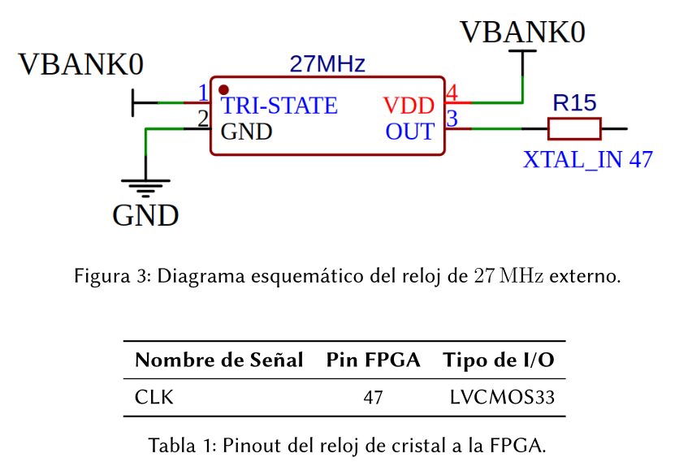
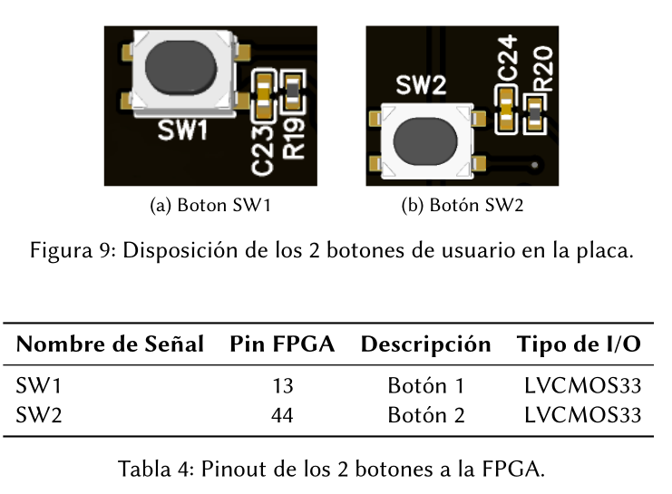
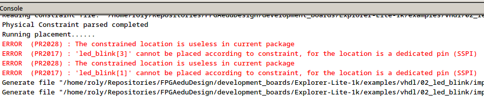
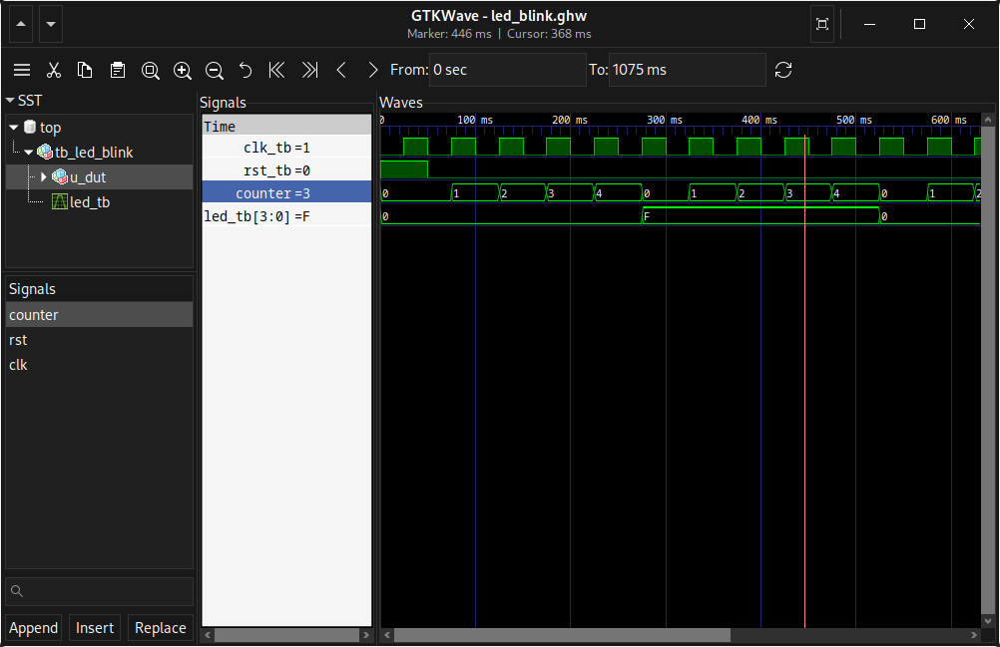

# 02_led_blink

Proyecto básico en VHDL para la placa Explorer Lite-1k donde 4 LEDs parpadean a una frecuencia de 2 Hz controlada por el reloj de 27 MHz de la placa.

---

## Estructura del proyecto

```text
02_led_blink/
├── docs/
│   ├── btn-board.png
│   ├── clk-board.png
│   ├── dedicated_pin-chip.png
│   ├── led_blink-esq.png
│   └── led_blink-sim.png
├── sim/
│   └── tb_led_blink.vhd
├── src/
│   ├── led_blink.vhd
│   └── 02_led_blink.cst
├── 02_led_blink.gprj
└── README.md
```

---

## Descripción

Este ejemplo muestra cómo generar una señal de parpadeo a partir del reloj principal de la FPGA mediante un contador, sin necesidad de un módulo top separado.

- El reloj de entrada es de **27 MHz** (pin 47).
- El reset es activo en **alto** (SW1, pin 13).
- Los LEDs togglean cada `clk_freq/4` ciclos, resultando en **2 Hz**.

```vhdl
if counter = clk_freq/4-1 then
    counter <= 0;
    led_reg <= not led_reg;
end if;
```

---

## Hardware utilizado

- Placa: Explorer Lite-1k
- FPGA: Gowin GW1NZ-LV1 (GW1NZ-LV1QN48C6/I5)
- Lenguaje: VHDL

---

## Reloj utilizado

El reloj de 27 MHz está conectado al pin 47 de la FPGA.

| Señal | Pin FPGA | Tipo de I/O |
|-------|----------|-------------|
| clk   | 47       | LVCMOS33    |

<p align="center">
  
</p>

---

## Botón de reset utilizado

| Señal | Pin FPGA | Descripción      |
|-------|----------|------------------|
| rst   | 13       | SW1, activo alto |

<p align="center">
  
</p>

---

## LEDs utilizados

| LED    | Pin FPGA |
|--------|----------|
| led[3] | 24       |
| led[2] | 23       |
| led[1] | 22       |
| led[0] | 21       |

<p align="center">
  
</p>

---

## Esquemático en Gowin EDA

El siguiente esquemático muestra el diseño generado en Gowin EDA.

<p align="center">
  
</p>

---

## Nota sobre pines SSPI

Los pines 22 y 24 corresponden a pines **SSPI** (Serial SPI) del chip,
que tienen función primaria de configuración. Al usarlos como salidas
de usuario para los LEDs, el enrutador los asigna mediante recursos
genéricos en lugar de los buffers dedicados. Esto no afecta el
funcionamiento en este diseño.

<p align="center">
  
</p>

---

## Simulación

El proyecto incluye un testbench compatible con:

- GHDL
- GTKWave
- ModelSim
- QuestaSim

Archivo de simulación:

```text
sim/tb_led_blink.vhd
```

### Estímulos aplicados

| Evento        | Duración  |
|---------------|-----------|
| Reset inicial | 1 ciclo   |
| 4 toggles     | ~1000 ms  |
| Reset final   | 1 ciclo   |

### Resultado esperado

Los LEDs deben togglear 4 veces de forma uniforme entre `0000` y `1111`, con reset limpio al inicio y al final.

<p align="center">
  
</p>

---

## Ejecutar simulación con GHDL

Ubicarse dentro del directorio del proyecto:

```bash
cd vhdl/02_led_blink
```

Importar los archivos VHDL:

```bash
ghdl -i sim/*.vhd src/*.vhd
```

Compilar el testbench:

```bash
ghdl -m tb_led_blink
```

Ejecutar la simulación y generar el archivo de ondas:

```bash
ghdl -r tb_led_blink --wave=led_blink.ghw
```

Abrir GTKWave:

```bash
gtkwave led_blink.ghw
```

---

## Implementación en Gowin EDA

### 1. Abrir el proyecto

Abrir el archivo:

```text
02_led_blink.gprj
```

### 2. Sintetizar el diseño

Ejecutar:

```text
Synthesis → Place & Route → Generate Bitstream
```

### 3. Programar la FPGA

Conectar la placa Explorer Lite-1k y cargar el archivo `.fs` generado en:

```text
impl/pnr/02_led_blink.fs
```

---

## Resultado final

<!-- Agregar enlace al video -->

---

## Autor

**Roly Sandro Gutierrez Benito**  
FPGAeduDesign

- Email: fpgaedudesign@gmail.com
- YouTube: FPGAeduDesign
- Web: fpgaedudesign.com
